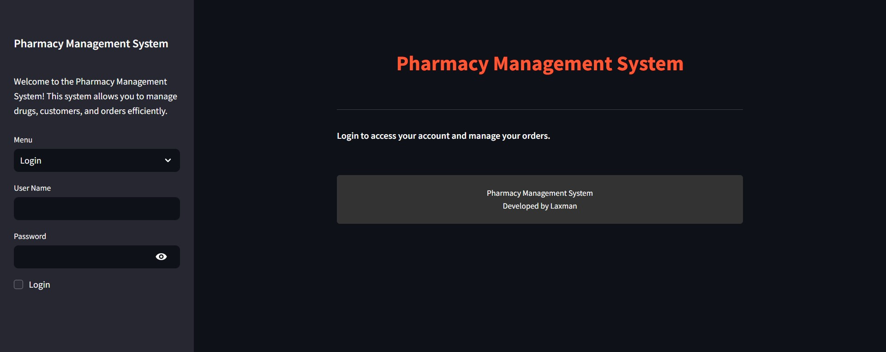
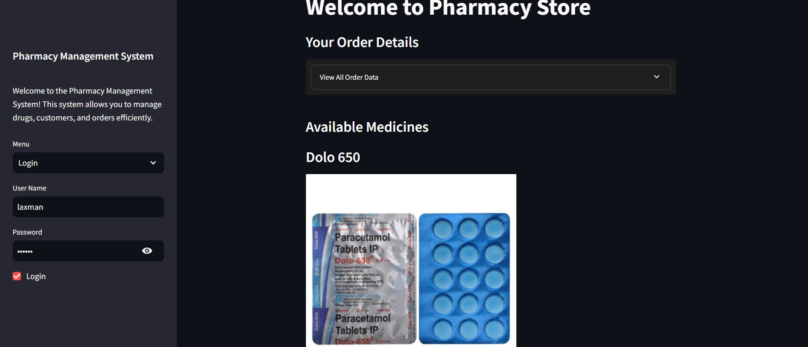
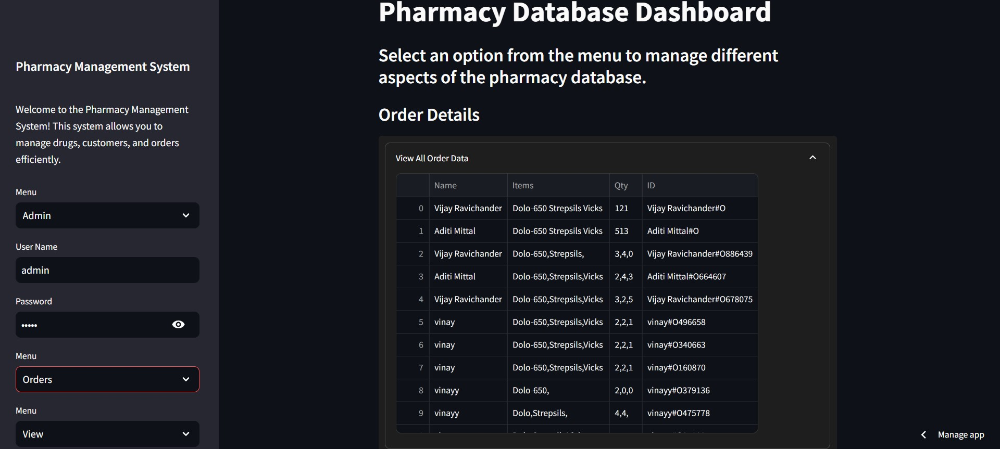

# Pharmacy Management System

Members:
- Laxman 
- Arun Prakash

STREAMLIT LINK: https://medi-inventory-manage.streamlit.app/

## Technologies Used

The core technologies include:

- **SQLite**: Used for database management, allowing for the storage and retrieval of customer, drug, and order data in a structured format.
- **Python**: The backend logic is implemented in Python, making use of its powerful libraries for data manipulation and server-side logic.
- **Streamlit**: For the frontend, Streamlit is used to create an interactive web application that allows users to interact with the system through a web interface.
- **CSV Files**: Drug data is also stored and read from CSV files, providing an easy way to update and manage the drug inventory without direct database manipulation.

## How It Works
The system connects these components to provide a seamless experience:

1. **Database Initialization**: Upon starting the application, the SQLite database is initialized with the necessary tables for customers, drugs, and orders if they do not already exist.
2. **User Interaction**: Users interact with the system through a Streamlit web interface, where they can view drug information, place orders, and manage their account.
3. **Data Management**: Behind the scenes, Python scripts handle the logic for database operations such as adding, updating, and deleting records based on user actions.
4. **Dynamic Content**: The drug inventory is dynamically loaded from CSV files, allowing for easy updates to the drug list without needing to alter the database directly.
5. **Security**: User authentication is managed through the database, ensuring that users can only access their information and order history.

By integrating these technologies, the Pharmacy Management System provides an efficient and user-friendly platform for managing pharmaceutical sales and inventory.

## PROBLEM STATEMENT
- In this era of growing demands of pharmaceutical and chemical products for health and medicine; every medical store, be it a small of medium sized businesses are running rampant towards efficient store management and rapid revenue computation. 
- Instead of using the conventional style of paper-based records and documentation, electronic methods are preferred for stock maintenance, automatic updation of records while billing and reliable electronic documentation.
- The software would reduce daily effort wage and labour numbers. Crushing numbers can now be left to the system.

## OBJECTIVE
- The aim of this project is to develop a software for the effective management of the database of a pharmaceutical store.
- It would improve the accuracy and enhance safety and efficiency in the pharmaceutical store.
- This system will help the pharmacist to maintain the records of the medicines, handle user and admin details, check and renew the validity of the medicines and orders placed by the customer.

## ER DIAGRAM
 

## OUTPUT
 
  
  
